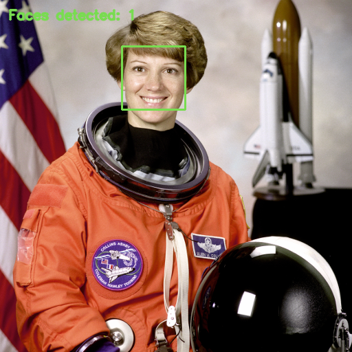

# Face Detection Lab

A small local face detector for images and a live webcam. It draws face boxes,
reports coordinates as JSON, and can pixelate detected regions. No account,
API key, server, or model training is required.



**Detection, not recognition.** This is a Python/OpenCV application using a
pretrained Haar cascade, not a newly trained model or an identity system.

## Run

Use standard CPython 3.11–3.14. On Apple Silicon, the pinned OpenCV wheel needs
macOS 13 or newer. Run these commands from this repository's directory:

```bash
bash setup.sh
.venv/bin/python -m face_detection image examples/astronaut.png --output outputs/demo.png
open outputs/demo.png  # macOS; on Linux open it with your image viewer
```

The sample produces a real detection and a sibling `outputs/demo.json`.
Existing output files are never overwritten; use another name on repeat runs.

Live camera preview:

```bash
.venv/bin/python -m face_detection webcam --camera 0
```

Allow camera access for Terminal (or the terminal-hosting application) when
macOS asks. Press **Q** or **Esc** with the preview focused to stop. Try
`--camera 1` when the intended camera is not index 0. Webcam frames are not saved.

Optional pixelation:

```bash
.venv/bin/python -m face_detection image examples/astronaut.png --output outputs/pixelated.png --blur
```

Personal images belong in the ignored `input/` directory. Do not publish
images of other people without appropriate permission.

## How it works

Read BGR pixels → resize the detection working copy → convert to grayscale →
equalize contrast → run the bundled frontal-face cascade → map boxes back to
original coordinates → draw or pixelate → save image and JSON.

`--scale-factor` controls scale-search steps; `--min-neighbors` changes how
many neighboring candidates must agree. `min_size` in the Python API is in
working-image pixels. See `docs/DESIGN.md` for the trade-offs.

## Tests

```bash
.venv/bin/python -m unittest discover -s tests -v
```

Tests include actual face detection on the sample, a blank negative case,
coordinate scaling, input preservation, invalid arguments, exclusive output
creation, and CLI execution. Camera-error cleanup is mocked; successful live
camera behavior still needs a hardware check. See `docs/VALIDATION.md`.

## Limits

Frontal Haar cascades may miss faces in profiles, poor light, occlusion, and
small images, and may produce false positives. There is no measured accuracy
claim. Pixelation only covers detected regions and is **not reliable
anonymization**. This is not an access-control, attendance, or surveillance
system. Image decoding uses native code; do not use it as a public upload
service or as a sandbox for hostile files. Encoded images are capped at 25 MiB;
the 40-megapixel check is after decoding, not a decoder-memory guarantee.

## Credits and license

Application: MIT. Maintainer: Shikhar Singh.
OpenCV and its pretrained model are third-party work. The NASA educational
sample and its annotated derivative have separate provenance in
[examples/CREDITS.md](examples/CREDITS.md). Read [docs/PROVENANCE.md](docs/PROVENANCE.md).

Official references: [OpenCV packages](https://pypi.org/project/opencv-python/4.13.0.92/)
and [cascade classifier](https://docs.opencv.org/3.4.20/db/d28/tutorial_cascade_classifier.html).
